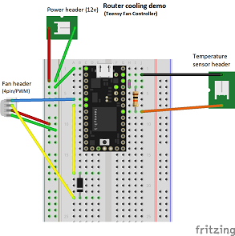
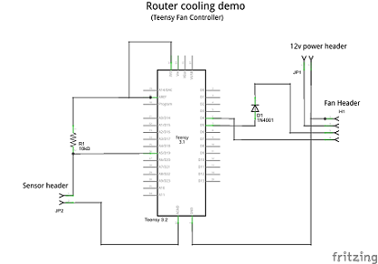
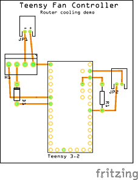
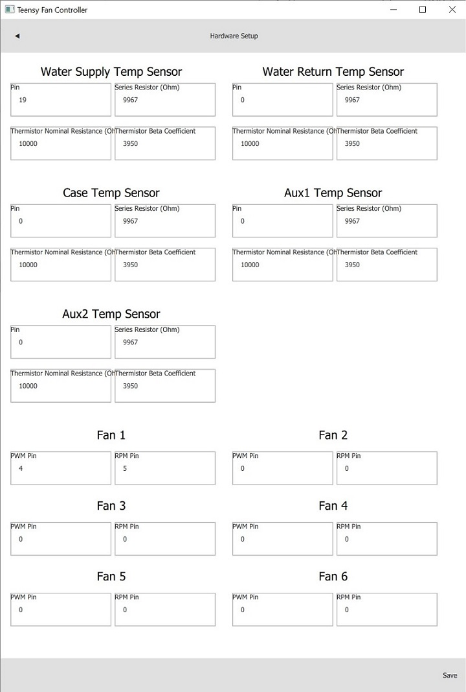

# Teensy Fan Controller - Router Cooling Demo

The controller is configured to cool a temperature sensor (placed between a desk router and switch) to a specific temperature.

A single PWM fan and single sensor is connected to a Teensy 3.2 using a breadboard.

## Hardware Requirements

1. One Breadboard, or a Teensy Fan Controller board (fe. Simple 001)
1. One Teensy 3.x with headers (previously *flashed with Teensy Fan Controller*)
1. A Micro USB cable
1. One 10k thermistor (fe. [Adafruit 10K Precision Epoxy Thermistor - 3950 NTC][1])
1. One 10k Ohm resistor (ideally 1% or better accuracy)
1. One standard/rectifier diode (fe. 1N4004)
1. One 12v power supply (up to 15V should be OK)
1. One PWM PC fan (80mm, 120mm, 140mm)
1. Wires

[1]: https://www.adafruit.com/product/372

## Hardware Setup

  

Steps to set up a breadboard with a Teensy 3.2, a single fan, a single temperature sensor, and a 12v power supply:

1. Place the **Teensy** into the top end of the breadboard (Teensy GND on breadboard row 1)
1. Place a **10k Ohm resistor** between **Teensy AREF** (breadboard **I4**) and **Teensy A5** (breadboard **I8**)
1. Place a **diode** with anode at **Teensy D5** (breadboard **A6**) and cathode at breadboard **row 22** (use a wire if needed)
1. Connect **Teensy GND** (breadboard **A1**) to the **GND bus** on the **left side** of the breadboard
1. Connect **Teensy AREF** (breadboard **H3**) to **Teensy V3.3** (breadboard **H4**)
1. Connect fan (4pin PWM):
   1. Connect **fan pin 1 (GND)** to the **GND bus** on the **left side** of the breadboard
   1. Connect **fan pin 2 (12V)** to the **PWR bus** on the **left side** of the breadboard
   1. Connect **fan pin 3 (RPM)** to breadboard **row 22** (cathode side of diode)
   1. Connect **fan pin 4 (PWM)** to **Teensy D4** (breadboard **A6**)
1. Connect thermistor:
   1. Connect **thermistor pin 1** to **Teensy A5** (breadboard **J8**)
   1. Connect **thermistor pin 2** to **Teensy AGND** (breadboard **J2**)
1. Connect 12v power supply the left breadboard bus:
   1. Connect **power supply GND** to the **GND bus** on the **left side** of the breadboard
   1. Connect **power supply +12V** to the **PWR bus** on the **left side** of the breadboard

### Sensor and fan placement

TODO 

<table>
<tbody>
<tr>
<td>

* The temperature sensor is placed between the cases of a router stacked on top of a switch
* The fan is pointed at the router/switch

</td>
<td align="right">

</td>
</tr>
</tbody>
</table>

## Software Setup

Note the Teensy connections made in the previous section:

Signal | Teensy Pin
------ | ---------
Fan 1 RPM pin | D5 (pin 5)
Fan 1 PWM pin | D4 (pin 4)
Thermistor pin 1 | A5 (pin 19)

Configure the software using the information given above:

<table>
<tbody>
<tr>
<td>

1. Connect the **Micro USB cable** to the **Teensy 3.x**
1. Launch **Teensy Fan Controller UI**
1. Select **Menu** > **Hardware Setup**
1. Enter the following:

    Field | Value
    ----- | -----:
    Water Supply Temp Sensor: Pin | **19**
    Water Return Temp Sensor: Pin | 0
    Case Temp Sensor: Pin | 0
    Aux1 Temp Sensor: Pin | 0
    Aux2 Temp Sensor: Pin | 0
    Fan 1: PWM Pin | **4**
    Fan 1: RPM Pin | **5**
    Fan 2: PWM Pin | 0
    Fan 2: RPM Pin | 0
    Fan 3: PWM Pin | 0
    Fan 3: RPM Pin | 0
    Fan 4: PWM Pin | 0
    Fan 4: RPM Pin | 0
    Fan 5: PWM Pin | 0
    Fan 5: RPM Pin | 0
    Fan 6: PWM Pin | 0
    Fan 6: RPM Pin | 0

1. Click **Save**
1. Click the **back arrow** on the top-left

</td>
<td align="right">

</td>
</tr>
</tbody>
</table>

