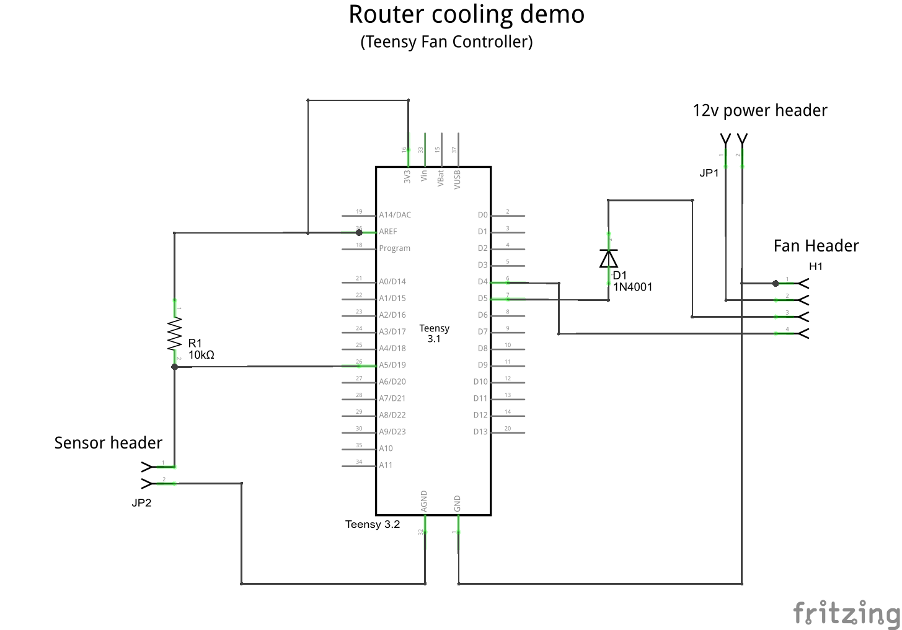
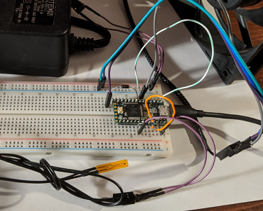

# Breadboard

A single PWM fan and single sensor is connected to a Teensy 3.2 using a breadboard.

## Hardware Requirements

1. One Breadboard
2. One Teensy 3.x with headers \(previously _flashed with Teensy Fan Controller_\)
3. A Micro USB cable
4. One 10k thermistor \(fe. [Adafruit 10K Precision Epoxy Thermistor - 3950 NTC](https://www.adafruit.com/product/372)\)
5. One 10k Ohm resistor \(ideally 1% or better accuracy\)
6. One standard/rectifier diode \(fe. 1N4004\)
7. One 12v power supply \(up to 15V should be OK\)
8. One PWM PC fan \(80mm, 120mm, 140mm\)
9. Wires

## Hardware Setup

 

Steps to set up a breadboard with a Teensy 3.2, a single fan, a single temperature sensor, and a 12v power supply:

1. Place the **Teensy** into the top end of the breadboard \(**Teensy GND** on breadboard **row 1**\)
2. Place a **10k Ohm resistor** between **Teensy AREF** \(breadboard **I4**\) and **Teensy A5** \(breadboard **I8**\)
3. Place a **diode** with anode at **Teensy D5** \(breadboard **A6**\) and cathode at breadboard **row 22** \(use a wire if needed\)
4. Connect **Teensy GND** \(breadboard **A1**\) to the **GND bus** on the **left side** of the breadboard
5. Connect **Teensy AREF** \(breadboard **H3**\) to **Teensy V3.3** \(breadboard **H4**\)
6. Connect fan \(4pin PWM\):
   1. Connect **fan pin 1 \(GND\)** to the **GND bus** on the **left side** of the breadboard
   2. Connect **fan pin 2 \(12V\)** to the **PWR bus** on the **left side** of the breadboard
   3. Connect **fan pin 3 \(RPM\)** to breadboard **row 22** \(cathode side of diode\)
   4. Connect **fan pin 4 \(PWM\)** to **Teensy D4** \(breadboard **A6**\)
7. Connect thermistor:
   1. Connect **thermistor pin 1** to **Teensy A5** \(breadboard **J8**\)
   2. Connect **thermistor pin 2** to **Teensy AGND** \(breadboard **J2**\)
8. Connect 12v power supply the left breadboard bus:
   1. Connect **power supply GND** to the **GND bus** on the **left side** of the breadboard
   2. Connect **power supply +12V** to the **PWR bus** on the **left side** of the breadboard

 

## Software Setup

Note the Teensy connections made in the previous section:

| Signal | Teensy Pin |
| :--- | :--- |
| Fan 1 RPM pin | D5 \(pin 5\) |
| Fan 1 PWM pin | D4 \(pin 4\) |
| Thermistor pin 1 | A5 \(pin 19\) |

Configure the software using the information given above:

1. Connect the **Micro USB cable** to the **Teensy 3.x**
2. Launch **Teensy Fan Controller UI**
3. Select **Menu** &gt; **Hardware Setup**
4. Enter the following:

   | Field | Value |
   | :--- | ---: |
   | Water Supply Temp Sensor: Pin | **19** |
   | Water Return Temp Sensor: Pin | 0 |
   | Case Temp Sensor: Pin | 0 |
   | Aux1 Temp Sensor: Pin | 0 |
   | Aux2 Temp Sensor: Pin | 0 |
   | Fan 1: PWM Pin | **4** |
   | Fan 1: RPM Pin | **5** |
   | Fan 2: PWM Pin | 0 |
   | Fan 2: RPM Pin | 0 |
   | Fan 3: PWM Pin | 0 |
   | Fan 3: RPM Pin | 0 |
   | Fan 4: PWM Pin | 0 |
   | Fan 4: RPM Pin | 0 |
   | Fan 5: PWM Pin | 0 |
   | Fan 5: RPM Pin | 0 |
   | Fan 6: PWM Pin | 0 |
   | Fan 6: RPM Pin | 0 |

5. Click **Save**


After making changes, the Hardware Setup screen should appear as: 


