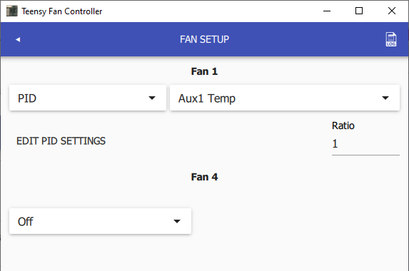
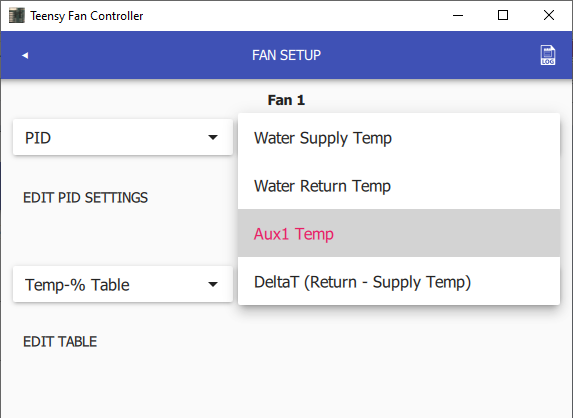
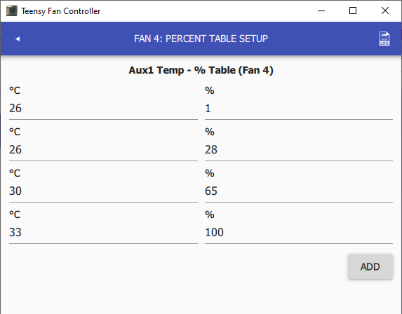
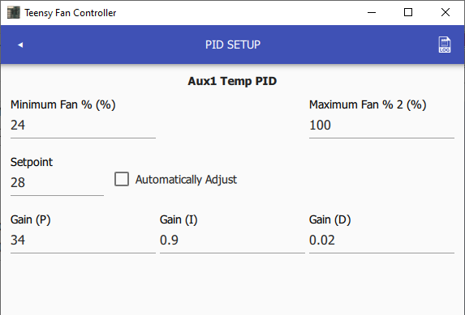
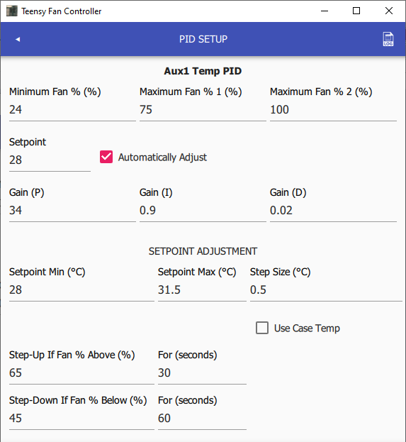
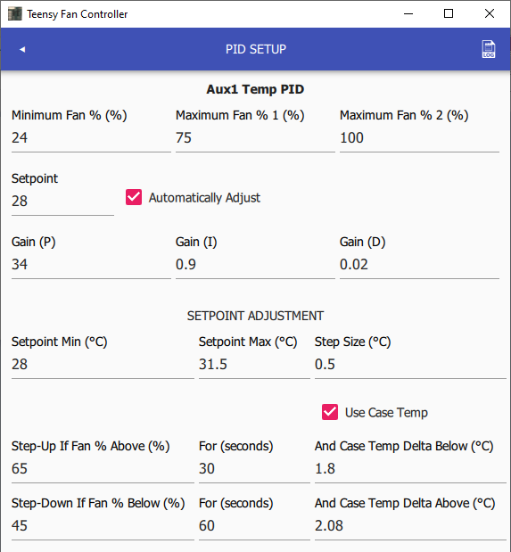
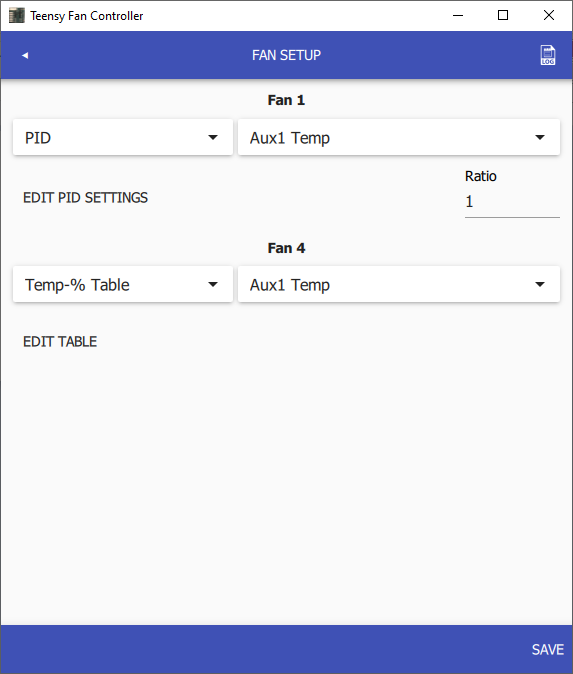

# Fan Setup

Fan speed configuration \(fe. control mode, temperature sensor source, etc.\).

Each available fan is individually configured:

## Fan Operation

Fan operation / control mode (PID, Temp-% Table, Fixed, Off):

If a fan's control mode is set to **PID** or **Temp-% Table**, a sensor is configured:

### Temp-% Table

TODO

If a fan's control mode is set to **Temp-% Table**, click **edit table** to configure the fan speed points:

### PID Setup

TODO

If a fan's control mode is set to **PID**, click **edit PID settings** to configure PID control:

Setpoint adjustment is enabled by checking **Automatically Adjust**:

Setpoint adjustment may be restricted by case temperature, by checking **Use Case Temp**:

## Saving Changes

Once configured, click **save** to upload the configuration onto the hardware:

