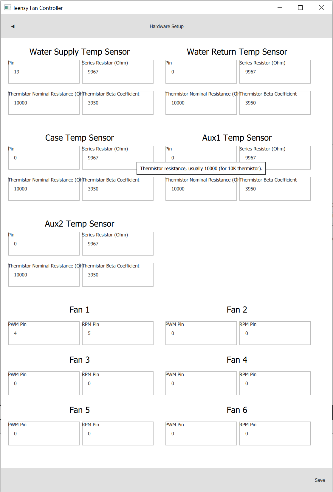

# Hardware Setup Screen

Hardware setup options for the Teensy Fan Controller.


Input fields on this screen are described when hovered with the mouse cursor.


## Fans

Up to six (6) fans are supported, and labeled by position (fan 1 through fan 6).
 
Hardware configuration options for each fan:

Field | Description
----- | -----
PWM Pin | Teensy pin number (must support PWM). Set to **0 if not connected**, or to not control fan's PWM signal
RPM Pin | Teensy pin number (must support interrupts). Set to **0 if not connected**, or to not monitor fan's RPM

## Temperature Sensors

Up to five (5) temperature sensors are supported, and labeled as supply water temp, return water temp, case temp, aux1 temp, and aux2 temp.

Hardware configuration options for each sensor:

Field | Description
----- | -----
Pin | Teensy (actual) pin number (must support Analog/ADC). Set to **0 if not connected**, or to disable the sensor 
Thermistor Beta Coefficient | Thermistor Beta coefficient, usually between 3000-4000 (fe. 3950 NTC)
Thermistor Nominal Resistance | Thermistor resistance, usually 10000 (fe. 10k, 50k, etc.)
Thermistor Series Resistance | Ohm value of series resistor used to pull-up thermistor, adjust this to calibrate reading (use a 10k Ohm resistor for 10k thermistor)

## Screenshot

