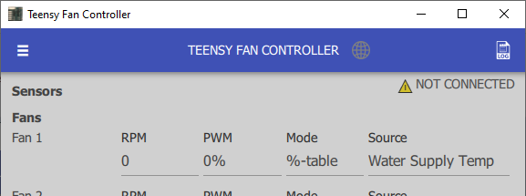
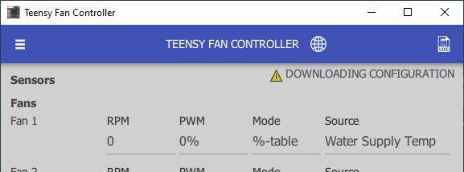
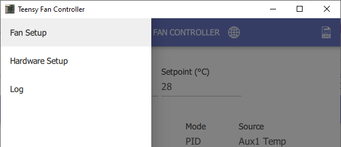
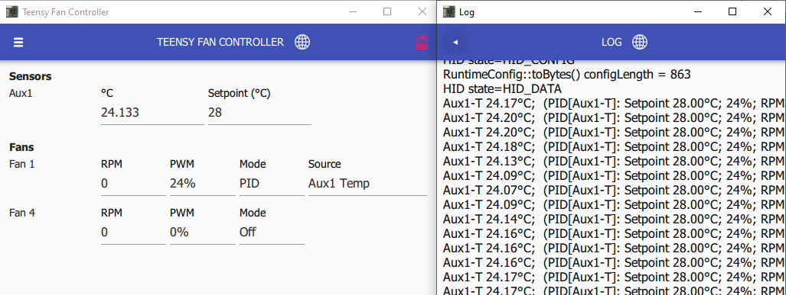
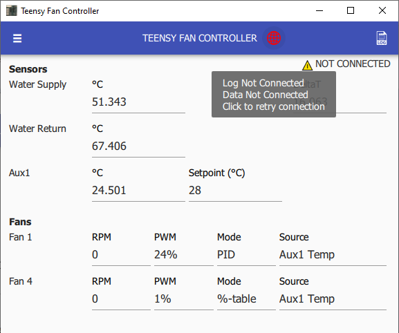

# Overview

A Qt 5 based application to configure or monitor a Teensy Fan Controller.


After clicking Save, the configuration is saved onto the hardware, and is restored after power-loss \(without using the _Management UI_\).


## Getting Started

The application attempts to connect when launched:

Once connected, the active configuration is downloaded:

Once downloaded, the present values are displayed:

## Usage

Clicking the **menu button** provides access to 3 pages:

The **log window** may also be opened by clicking the **LOG button** on the top right:

If the application fails to connect, or losses connection, the red globe icon in the toolbar may be clicked to reconnect:

### Pages

| Page | Description |
| :--- | :--- |
| Controller Status (Home) | Display current fan RPMs and temperature readings \(updates every 500 ms\) |
| Hardware Setup | Sensor and fan hardware configuration \(fe. pin mapping, thermistor resistance, etc.\) |
| Fan Setup | Fan speed configuration \(fe. control mode, temperature sensor source, etc.\) |
| Controller Log | Debug logs sent from controller \(values printed every 5 seconds\) |

