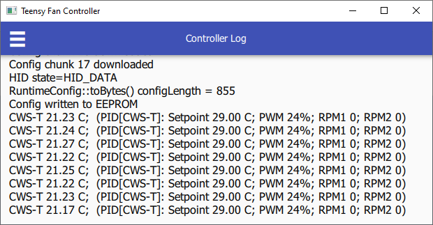
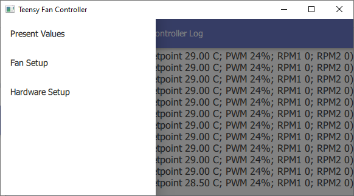

# Management UI

A Qt 5 based application to configure or inspect a Teensy Fan Controller.


After clicking Save, the configuration is saved onto the hardware, and is restored after power-loss (without using the *Management UI*).



Monitoring fan RPMs and temperature readings is better accomplished using the [liquidtux Linux hwmon module][1] (a Windows equivalent will be available later).


[1]: https://github.com/mstrthealias/liquidtux

## Usage

The application opens to the *Controller Log* page:

Clicking the **menu button** provides access to 3 additional pages:

### Pages

Page | Description
---- | -----
Controller Log | Debug logs sent from controller (values are printed every 5 seconds)
Present Values | Display current fan RPMs and temperature readings (updates every 500 ms)
Fan Setup | Fan control setup
Hardware Setup | Sensor and fan hardware configuration (fe. pin mapping, thermistor resistance, etc.)
