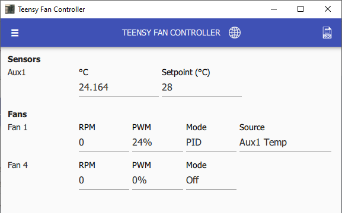

# Controller Status (Home Screen)

Displays present temperatures, present fan speeds, and active fan configurations.


Disabled fans or sensors (**pin set to 0**) will be hidden from this view.



Fan RPMs and temperature readings may be monitored using the [liquidtux Linux hwmon module](https://github.com/mstrthealias/liquidtux) \(a Windows equivalent will be available later\).


TODO

